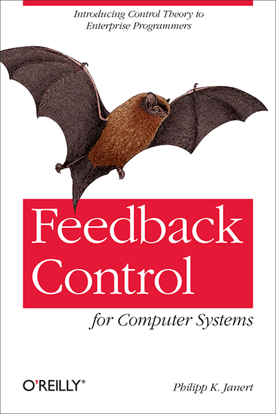

# Feedback Control for Computer Systems

Examples and code for the book _Feedback Control for Computer Systems_
by Philipp K. Janert (O'Reilly, 2013)




## Description

This repository contains the Python code of the examples in the book.

The original code from the book is in the `python2` directory; versions
of the programs updated to Python 3 are in the `python3` directory.

### Usage

The code for the short demos in chapters 1, 2, and 3 does not
have dependencies (except for the Python standard library).

The code for the Case Studies in chapters 13-18 depends on the
simulation "framework" introduced in chapter 12. This common 
code is contained in the file `feedback.py`. Place this file
in the same directory as the case study you want to run, or
add its location to the `PYTHONPATH` environment variable.

### Downloading the Source Code

To download the examples, you may clone the repository:

```
git clone git://github.com/janert/feedback-control-for-computer-systems
```

Alternatively, download all the files as zipped archive from:

```
https://github.com/janert/feedback-control-for-computer-systems/archive/master.zip
```

(or using the green button in the top right corner of this page), then
unpack them using:

```
unzip feedback-control-for-computer-systems-master.zip
```

## Resources

- Catalog Page on O'Reilly: https://www.oreilly.com/library/view/feedback-control-for/9781449362638/

## Author

Philipp K. Janert
